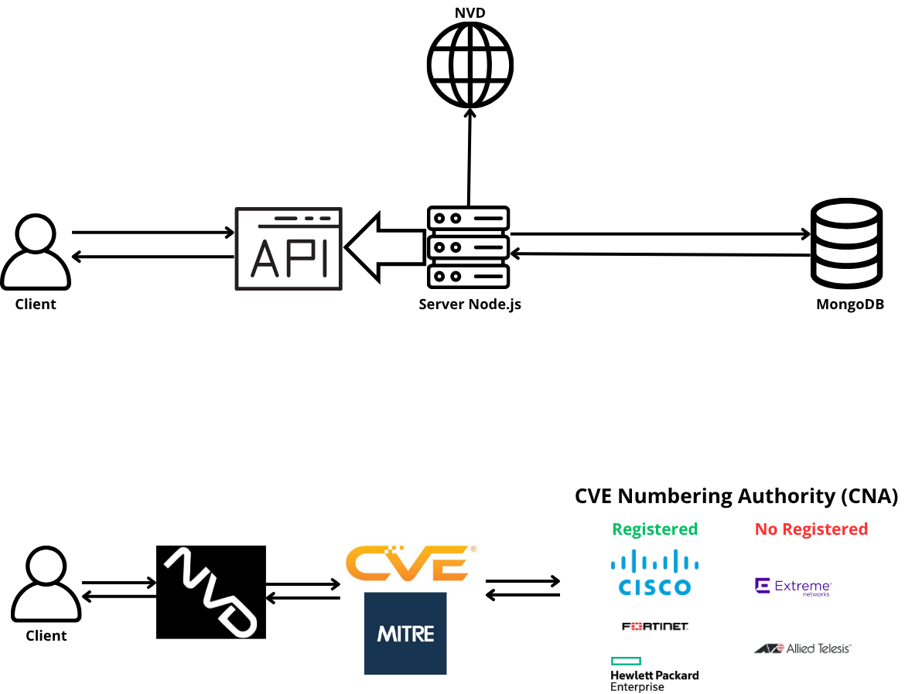

# CVE_Management_Service
Application to manage the vulnerabilities from the NVD related to networking devices

The main objective of this proyect will be to improve the IT hardening process related to the software
status of network equipment. The first procedure will be an investigation and study on the existence
and feasibility of a repository on vulnerabilities, compatibility, software, and hardware status of network
equipment from Cisco, Aruba, Allied, Extreme Networks, Fortinet and Comware. Finally, a database
will be designed and implemented with all the information obtained, and at the same time an API will
be created for a possible implementation of this service in third party applications.

## Requirements:

Create an .env with the following environment variables:

You need to obtain an API-KEY through the following url:

    https://nvd.nist.gov/developers/request-an-api-key

    PERSONAL_NVD_API_KEY
    MONGO_INITDB_ROOT_USERNAME
    MONGO_INITDB_ROOT_PASSWORD

## Installation:

    docker-compose up -d

## Database volume

-Path: 

    ~/mongodb-volume

-Version:

    -MongoDB 7.0.7 Community(It was the latest version at the time of the project)

    -Docker will make an automatic pull of the mongo image in case we don't have it, in case of error execute: docker pull mongo:latest

-Description:

    Database changes are persistent.

## Web server

-Path: 

    ~/node-express

-Version:

    -Node.js v20.11.1

Description:

    Server in charge of receiving information from the NVD, making changes to the mongodb and sending this information to the user.

    To access the information, a request must be made to port 3000. 

## API Requests:

    GET /manufacturers
    GET /manufacturers/:manufacturerId
    GET /manufacturers/:manufacturerId/:soId/versions
    GET /manufacturers/:manufacturerId/:soId/versions/:versionId
    GET /manufacturers/:manufacturerId/:soId/versions/:versionId/vulnerabilities
    GET /manufacturers/:manufacturerId/:soId/versions/:versionId/vulnerabilities/cvelist
    GET /manufacturers/:manufacturerId/:soId/versions/:versionId/vulnerabilities/cvelist/:vulnerabilityId
    GET /manufacturers/:manufacturerId/:soId/versions/:versionId/vulnerabilities/cvelist/risk?severity=XXX
    PUT /update-version/:soId/:versionId/:eol/:eoes/:eos (Admite fechas o UNKNOWN, LATEST, TBD (en mayuscula))
    POST /add-version/:soId/:versionId/:eol/:eoes/:eos (Admite fechas o UNKNOWN, LATEST, TBD (en mayuscula))
    DELETE /delete/:soId/:versionId
    PUT /update-cves-one-version/:manufacturerId/:soId/:versionId
    PUT /update-db

## Example of request with CiscoIOS15.0(1)m version, Recommended to follow in order

    https://localhost:3000/manufacturers
    https://localhost:3000/manufacturers/cisco
    https://localhost:3000/manufacturers/cisco/ios/versions/15.0(1)m
    https://localhost:3000/manufacturers/cisco/ios/versions/15.0(1)m/vulnerabilities
    https://localhost:3000/manufacturers/cisco/ios/versions/15.0(1)m/vulnerabilities/cvelist
    https://localhost:3000/manufacturers/cisco/ios/versions/15.0(1)m/vulnerabilities/cvelist/CVE-2022-20920
    https://localhost:3000/manufacturers/cisco/ios/versions/15.0(1)m/vulnerabilities/cvelist/severity/risk?severity=critical
    https://localhost:3000/update-version/IOS/15.0(1)m/TBD/TBD/TBD 
    https://localhost:3000/delete/ios/15.0(1)m
    https://localhost:3000/add-version/ios/15.0(1)m/UNKNOWN/UNKNOWN/UNKNOWN
    https://localhost:3000/update-cves-one-version/cisco/ios/15.0(1)m
    https://localhost:3000/update-db

## Version

    v1.0

## Author

    Ignacio Botella Lledin
